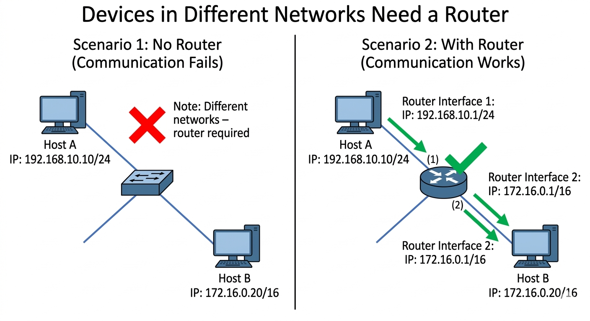

# Level 4 – Communication Between Networks Requires a Router

## 🖼️ Network Diagram

## 📘 Overview

This example introduces the concept of communication between different networks.

Even if devices are physically connected through a switch, communication between different networks requires a router.  
A switch can only forward traffic inside the same network, while a router forwards packets between different networks.

---

## 🟢 Network A

- **Host A:** 192.168.10.10/24  

With a `/24` mask, the network becomes:

192.168.10.0/24

Devices inside this network can communicate directly with each other.

---

## 🔵 Network B

- **Host B:** 172.16.0.20/16  

With a `/16` mask, the network becomes:

172.16.0.0/16

This network is different from Network A.

Because of that, Host A cannot communicate directly with Host B.

---

## 🔵 Router Role

The router connects the two different networks using its interfaces:

- **Router Interface 1:** 192.168.10.1/24  
- **Router Interface 2:** 172.16.0.1/16  

Each interface belongs to a different network.

The router acts as the **gateway** that allows communication between the two networks.

---

## What Happens

If Host A wants to communicate with Host B, it must send packets to its **default gateway (the router)**.

The router receives the packet, checks the destination network, and forwards it to the correct interface connected to Host B's network.

Without a router, devices cannot communicate with networks outside their local subnet.
